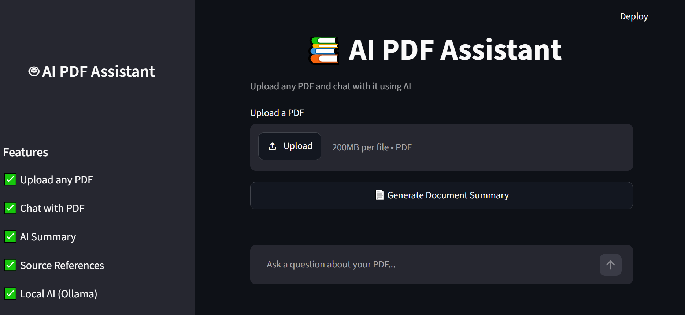
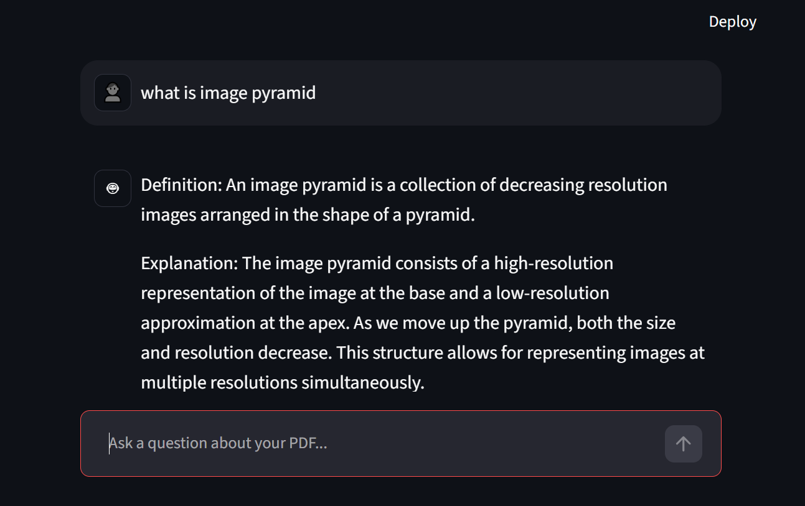
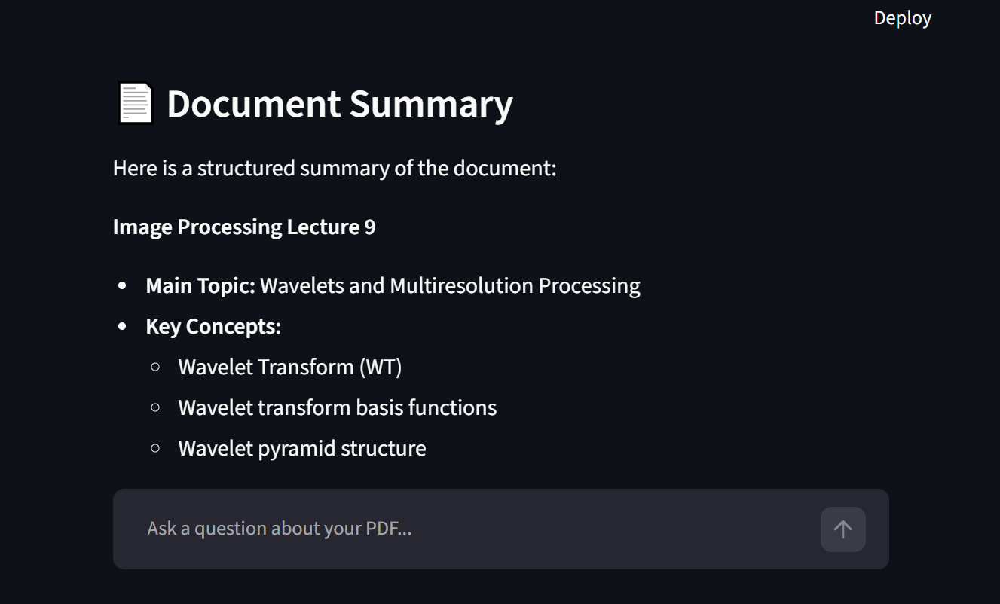

# 📚 AI PDF Assistant

AI-powered PDF chatbot built using Streamlit, Ollama, FAISS, and Sentence Transformers.

## 🚀 Features

- Upload any PDF document
- Ask questions about the document
- AI-generated document summaries
- Semantic search using vector embeddings
- Source references for answers
- Local AI inference using Ollama
- Modern Streamlit interface

---

## 🛠️ Tech Stack

- Python
- Streamlit
- Ollama
- Llama 3.2
- FAISS
- Sentence Transformers
- PyPDF

---

## 📸 Screenshots

### Upload PDF



---

### Chat with PDF



---

### Document Summary



---

## 📂 Project Structure

```text
rag-chatbot/
├── assets/
├── documents/
├── src/
│   ├── app.py
│   ├── chatbot.py
│   ├── retriever.py
│   └── ingest.py
├── requirements.txt
├── .gitignore
└── README.md
```

## ⚙️ Installation

Clone the repository:

```bash
git clone https://github.com/Hibza-Kudari/rag-chatbot.git
cd rag-chatbot
```

Create virtual environment:

```bash
python -m venv venv312
```

Activate environment:

```bash
venv312\Scripts\activate
```

Install dependencies:

```bash
pip install -r requirements.txt
```

Install Ollama model:

```bash
ollama pull llama3.2
```

---

## ▶️ Run

```bash
streamlit run src/app.py
```

Open:

```text
http://localhost:8501
```

---

## 💡 Usage

1. Upload a PDF
2. Generate a document summary
3. Ask questions about the PDF
4. View source references used by the chatbot

---

## 👩‍💻 Author

**Hibza Kudari**